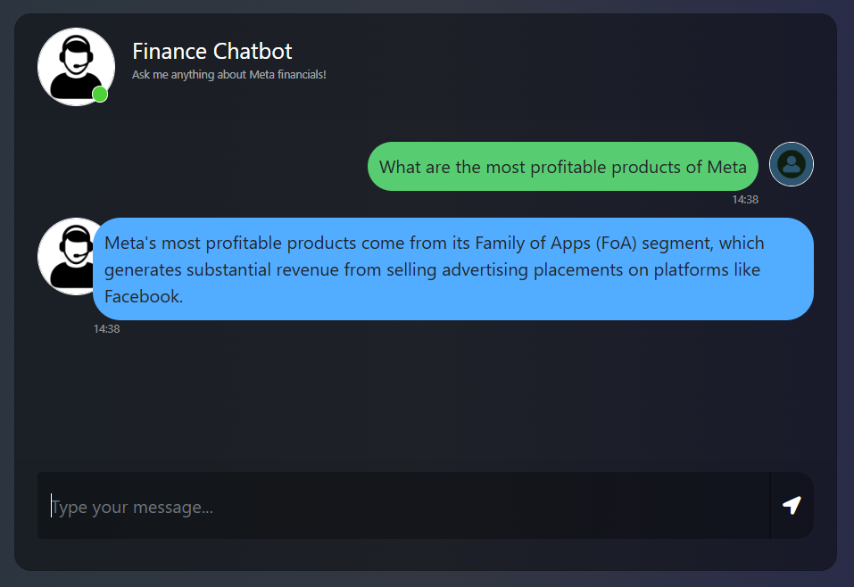
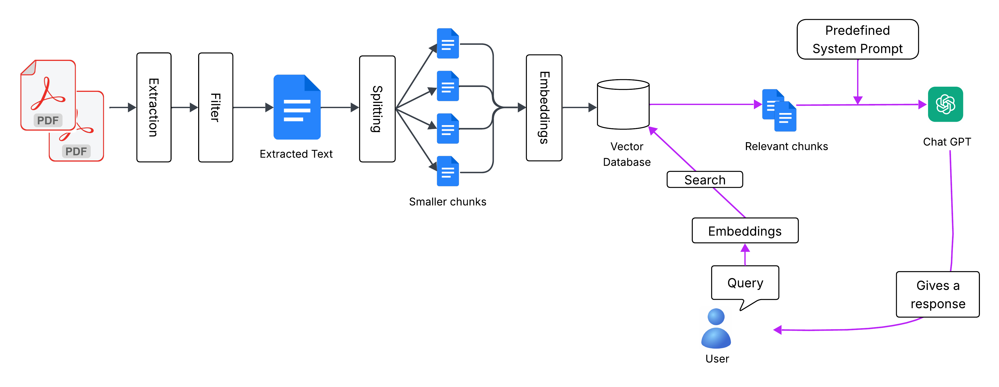

# Finance_Chatbot - Complete-Finance-Chatbot-with-LLMs-LangChain-Pinecone-Flask-GCP



## Business Problem
As part of supporting the Business Analysis team, I need to help them access insights from confidential documents—especially PDF files—in a way that’s fast, secure, and user-friendly. Their goal is to make strategic decisions that drive business transformation, and they need a solution that allows them to interact with these documents in a conversational manner.

This project is focused on building a system that enables quick, natural-language responses from sensitive content, helping analysts get the information they need without delays or complexity. The interface must be intuitive, responsive, and respectful of data confidentiality, so they can focus on making informed decisions which not digging through files.

## System Design


### STEP 1:

Clone the repository

```bash
Project repo: https://github.com/Shihamfm/Finance_Chatbot.git

```
### STEP 2 - Create a virtual environment after opening the inventory

```bash
python -m venv finance_chatbot
```

```bash
source finance_chatbot/Scripts/activate
```

### STEP 3 - Install the requirements
```bash
pip install -r requirements.txt
```
### STEP 4 -  Create a .env file in the root directory and add the Pinecone & openai credentials as follows:
```bash
PINECONE_API_KEY = "xxxxxxxxxxxxxxxxxxxxxxxxxxxxx"
OPENAI_API_KEY = "xxxxxxxxxxxxxxxxxxxxxxxxxxxxx"
```
```bash
# run the following command to store embeddings to pinecone
python store_index.py
```

```bash
# Finally run the following command
python app.py
```
Now,
```bash
open up localhost:
```
## Techstack Used:
- Python
- LangChain
- Flask
- GPT
- Pinecone

## GCP-CICD-Deployment-with-Github-Actions

### 1. Enable required services
```bash
gcloud services enable artifactregistry.googleapis.com run.googleapis.com
```
### 2. Create Artifact Registry for Docker images
```bash
gcloud artifacts repositories create finace-chatbot-repo \
  --repository-format=docker \
  --location=us-central1 \
  --description="Docker repo for CI/CD images"
```
## Service Account and Permissions
### 1. Create a service account (if not already created):
```bash
gcloud iam service-accounts create github-cicd \
  --description="Service Account for GitHub Actions CI/CD" \
  --display-name="github-cicd"
```
### 2. Download the JSON key and add it to GitHub secrets as FINANCE_CHATBOT.
### 3. Grant IAM roles for the service account

```bash
SA_EMAIL=finance-chatbot@utility-ridge-464606-a1.iam.gserviceaccount.com

# Artifact Registry push permission
gcloud projects add-iam-policy-binding utility-ridge-464606-a1 \
  --member="serviceAccount:$SA_EMAIL" \
  --role="roles/artifactregistry.writer"

# Cloud Run deploy permission
gcloud projects add-iam-policy-binding utility-ridge-464606-a1 \
  --member="serviceAccount:$SA_EMAIL" \
  --role="roles/run.admin"

# Service Account User role (required for Cloud Run)
gcloud projects add-iam-policy-binding utility-ridge-464606-a1 \
  --member="serviceAccount:$SA_EMAIL" \
  --role="roles/iam.serviceAccountUser"
```

### 4. Set up a Docker file

### 5. Set up .github/workflows/cicd.yaml for GitHub Actions CI/CD